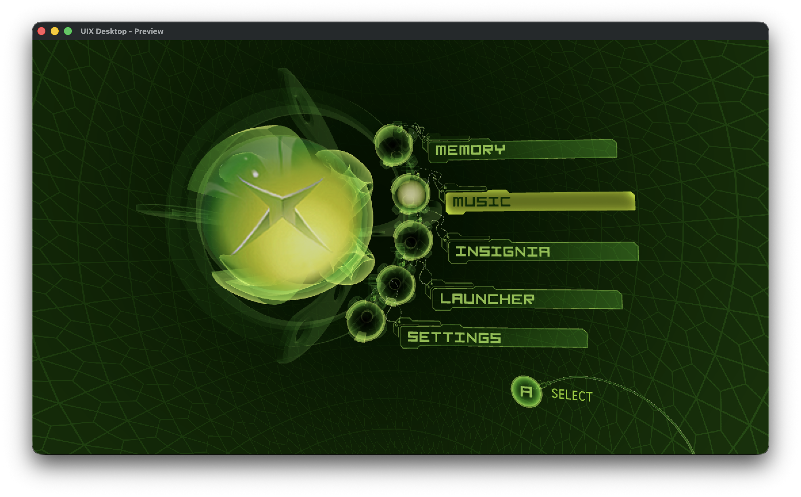
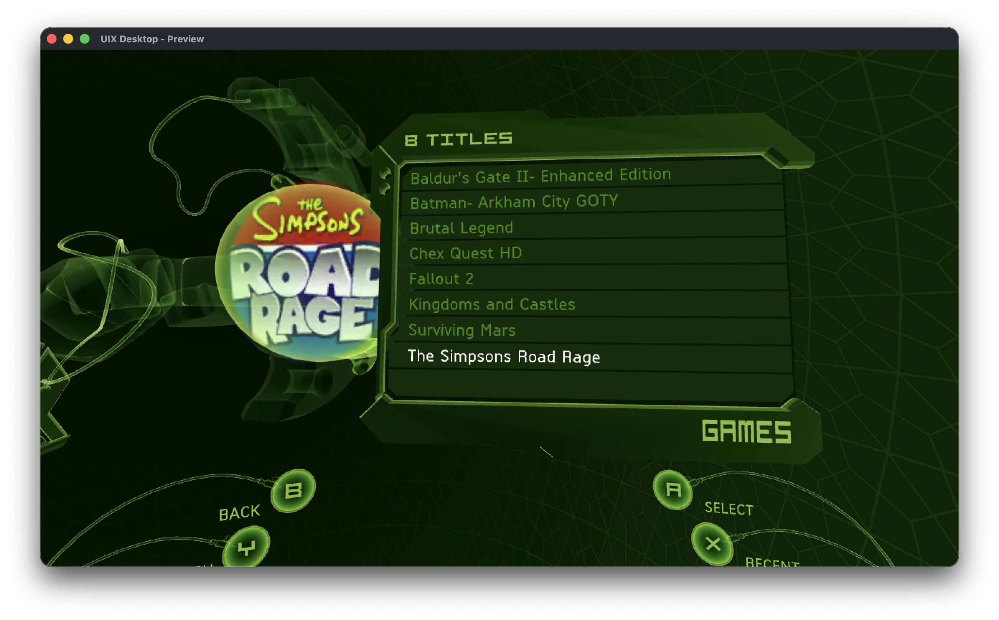
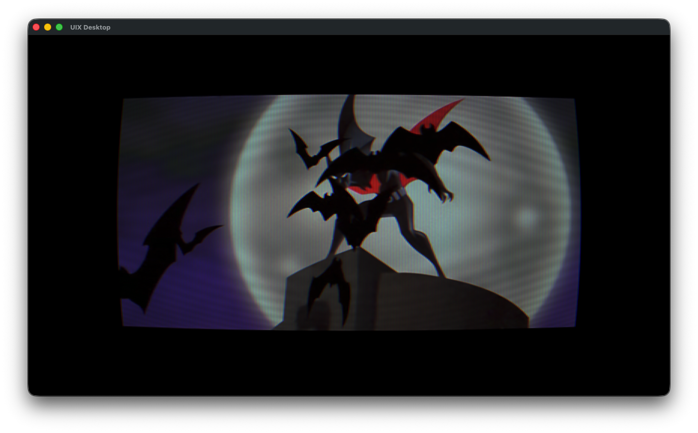
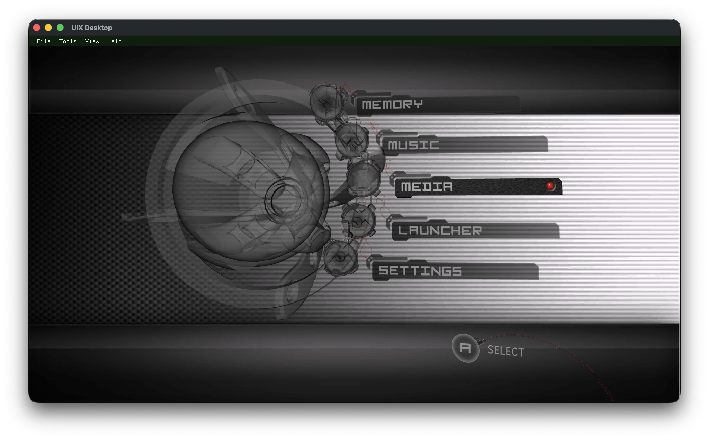
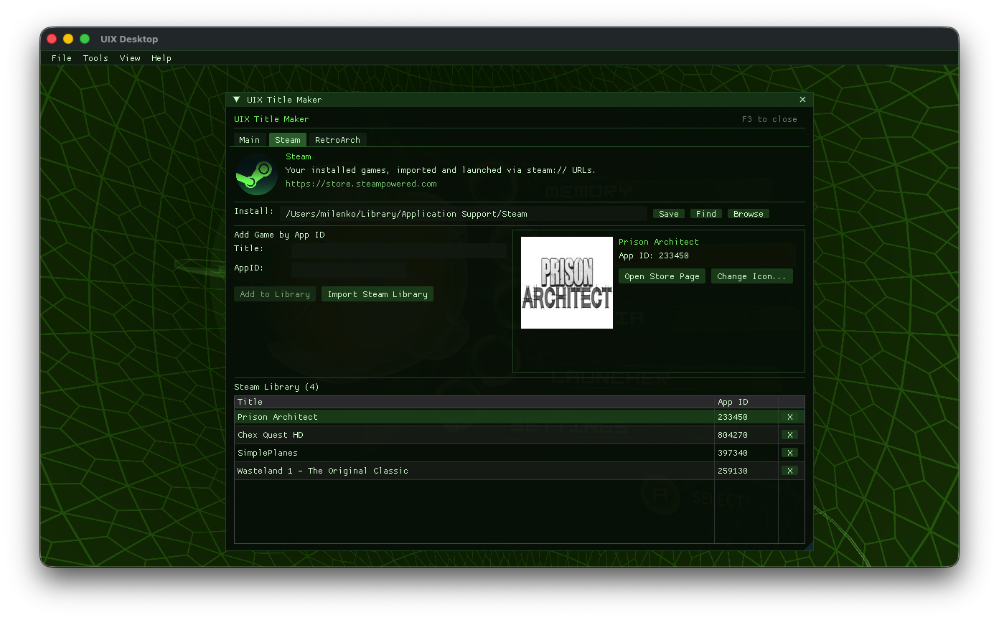
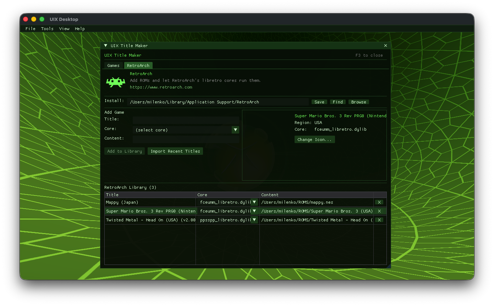

# Theseus

[](https://github.com/MrMilenko/Theseus/actions/workflows/build.yml)
[](LICENSE)
[](#)
[!](https://discord.gg/qfVHTYD4xX)

<p align="center">
  
  &nbsp;&nbsp;&nbsp;&nbsp;
  
</p>

Six years of reverse engineering the original Xbox dashboard. This repo is the result.

Theseus boots on modded Xbox hardware as a drop in replacement for the stock dashboard. The same engine compiles natively on macOS, Linux, and Windows, where it doubles as **UIX Desktop**: a 3D launcher and media center. The desktop build renders through [bgfx](https://github.com/bkaradzic/bgfx): Metal on macOS, Vulkan on Linux and Windows.

The split is intentional. The Xbox build stays faithful to what you'd expect from the Xbox dashboard (or UIX Lite, if you've used a custom dashboard before). Everything that doesn't belong on an Xbox (Steam libraries, modern video playback, emulator-hosted ISOs, playlists, skin authoring tools) lives on the desktop side instead. Two projects, one engine.

<p align="center">
  
  
</p>
<p align="center">
  
  
</p>
<p align="center">
  
  
</p>

---

**Running it:** [Quick Start](#quick-start) · [Features](#features) · [Adding games](#adding-games) · [Where your stuff lives](#where-your-stuff-lives) · [Customization](#customization) · [Controls](#controls-desktop)

**Working on it:** [Dependencies](#dependencies) · [Building](#building) · [How it works](#how-it-works) · [Heritage](#heritage) · [Credits](#credits) · [Third-party](#third-party-libraries) · [License](#license)

---

## Quick Start

### Xbox

1. Grab the latest Xbox release (`default.xbe` + `uixdata/`)
2. Drop the XBE somewhere on the Xbox HDD, e.g. `E:\Dashboards\Theseus\default.xbe`
3. Copy `uixdata/` next to it
4. Copy `Configs/` to `C:\UIX Configs\`
5. Boot it. If something's missing, the panic screen tells you what.

[Download for Xbox ->](https://github.com/MrMilenko/Theseus/releases)

### Desktop

1. Grab the release for your OS
2. Install the runtime libraries for your platform (see [Dependencies](#dependencies))
3. Run it

Windows is the exception: that release ships with the DLLs it needs, so step 2 is already done for you. macOS and Linux link against system libraries.

[Download for desktop ->](https://github.com/MrMilenko/Theseus/releases)

Building from source instead? Jump to [Building](#building).

## Features

### Xbox

A drop-in replacement for the stock Xbox dashboard on modded consoles. Same look and behavior, because that's what it is. Rebuilt plank by plank and still going.

- Every original scene, animation, and skin slot
- UIX Lite skins drop in unchanged. Skin authors don't have to do anything
- Hot swap skins from settings, no reboot
- ISO / CCI launching from the harddrive menu, plus the original XBE flow
- Hundreds of titles scan in milliseconds
- Title icons auto populate from each game's XBE certificate
- Quick overlay (LT + B) for ISO loader, file manager, FTP / drive widgets
- FTP server, recovery / panic screen, MP3 soundtrack playback

### UIX Desktop

The Theseus engine compiled for your computer, with the modern features bolted on. macOS, Linux, Windows, Steam Deck friendly.

- **3D launcher** for native PC games, Steam libraries, RetroArch ROMs, and Xbox ISOs via [xemu](https://xemu.app)
- **xCloud / Game Pass streaming** signs in with your Xbox account and drops your whole cloud library into the games grid, box art and all. Remote play for your own console shows up under "Your Xbox"
- **Media library** that scans your Movies and TV folders, pulls posters from [TMDB](https://www.themoviedb.org/), and plays back through libmpv. [Plex](https://www.plex.tv/) and [Jellyfin](https://jellyfin.org/) servers browse and stream in the same UI (Jellyfin signs in with Quick Connect)
- **Music visualizer** with in-scene [projectM](https://github.com/projectM-visualizer/projectm) (MilkDrop) presets reacting to whatever's playing
- **Skin editor** with live XAP scripting and a scene inspector. Change a skin, see it instantly
- **Title Maker** for adding games and apps, with per launcher import flows for Steam and RetroArch
- **Xbox HDD browser** that opens qcow2 and FATX images
- **CRT post process** for the old TV look. Scanlines, curvature, phosphor, bloom, all tunable
- **Graphics knobs** in Settings > Display: vsync mode, FPS cap, MSAA, hardware video decode
- **Controllers**: Xbox and PlayStation pads via SDL2

## Adding games

Title Maker (F3 from the dashboard) is where you connect games to dashboard tiles. Three tabs:

**Main** is the catch all. Every title you've added shows up here, regardless of which tab created it. This is also where you add the weird stuff that doesn't belong to a launcher: a Windows .exe, a .bat script, a macOS .command file, a shell one liner, anything that takes a path or command. Edit names, swap icons, tweak the launch line. Most of your time managing the library happens here.

**Steam** auto detects your Steam install (Find button), or you point at it once. Hit Import Steam Library and your installed games come in with icons fetched from Valve's CDN. There's also a manual "Add by App ID" form for launching betas, demos, or games not in your normal library scan.

**RetroArch** detects your RetroArch install the same way. Import Recent Titles pulls in everything you've recently played in RetroArch, with the right core auto resolved and boxart copied from RetroArch's thumbnail packs. You can also add manually: pick a ROM, pick a core from the dropdown, done.

If you don't use Steam or RetroArch, you can turn either tab off under Optional Tabs (top of Main). Anything you've already added stays in Main either way.

## Where your stuff lives

Everything you can customize sits in a per OS user directory, not next to the
binary. It's created and seeded on first run, and an existing side by side
install is migrated across once.

| | |
|---|---|
| macOS | `~/Library/Application Support/Theseus/` |
| Linux | `$XDG_DATA_HOME/theseus`, else `~/.local/share/theseus` |
| Windows | `%APPDATA%\Theseus\` |

Configs, Library and most of Data live there: skins, orbs, music, screenshots,
fonts, saves and settings. Only the compiled shaders stay with the binary, so a
signed .app, a .deb or a flatpak can ship a read only payload without breaking
anything you own.

**Settings > General > Open User Directory** takes you straight there, which is
the quickest way to check what the app is actually reading.

On Xbox nothing changed: `C:\UIX Configs\`, `uixdata\` and the rest are where
they always were.

## Customization

**Skins.** Drop them into `Data/Skins/` inside the user directory above (Xbox: `uixdata\Skins\`) and pick from settings. UIX Lite community skins work as is, no conversion needed. Hot swap, no reboot.

**Scene authoring** (for the people building dashboards from scratch). Scenes are XAP scripts packed into `.xip` archives. The desktop build has a live XAP editor (F2), scene inspector (F1), and asset reload so you can tweak and see results immediately. The XAP node interface is the contract; the C++ behind it can change but the node API is treated as sacred. Full reference in [`docs/xap-contract.md`](docs/xap-contract.md).

## Controls (desktop)

### Controller

Xbox and PlayStation pads work via SDL2 GameController. The dashboard itself is
pad driven as you'd expect; the tool windows have their own mode.

| Input | Action |
|---|---|
| **LT + B** | Toggle pad mode. Same chord as the Xbox overlay |
| Stick / D-pad | Move |
| A | Select |
| B | Back out one layer, then close pad mode |
| Y | Open a text field, which brings up the on screen keyboard |
| Hold X | Move and resize windows, for when one outgrows the screen |

In pad mode the menu bar steps aside for a controller menu, the pad drives the
tools instead of the dashboard, and a prompt bar along the bottom says what the
buttons currently do. On screen keyboard has letters, numbers and a symbol page
for paths. Turn the whole thing off with `PadMode=0` in `Configs/desktop.ini`.

Skin Editor stays mouse and keyboard only: colour pickers and direct
manipulation don't translate to a stick. Keyboard equivalents:

<details>
<summary><b>Dashboard navigation</b></summary>

| Key | Xbox button | Action |
|---|---|---|
| Arrow keys | D-pad | Navigate |
| Enter / Space | A | Select |
| Backspace | B | Back |
| X / Y | X / Y | Context actions |
| Tab | White | Play / Pause |
| ` (backtick) | Black | Stop |
| WASD | Left stick | Analog navigation |

</details>

<details>
<summary><b>Media playback</b></summary>

| Key | Action |
|---|---|
| Esc / Q | Stop, return to dashboard |
| Space | Pause / Resume |
| Left / Right | Seek 5s |
| `[` / `]` | Previous / Next in playlist |
| T | Track picker (audio + subtitles) |

</details>

<details>
<summary><b>Tools (desktop only)</b></summary>

| Key | Action |
|---|---|
| F1 | Scene inspector |
| F2 | XAP script editor |
| F3 | Title Maker |
| F4 | Settings |
| F5 | Xbox HDD browser |
| F6 | Playlist Maker |
| F10 | Toggle menu bar |
| F11 | Toggle fullscreen |
| Ctrl+M | Mute |
| Ctrl+R | Restart dashboard |

</details>

---

# For developers

The rest is build instructions, architecture notes, and the lineage. Skip if you just want to run it.

## Dependencies

One list, used by both the [Quick Start](#quick-start) and [Building](#building). "Run" is what a downloaded release needs; "Build" is that plus the toolchain and headers.

**macOS (Homebrew):**

```
# Run a release
brew install sdl2 sdl2_mixer mpv curl ffmpeg opus

# Build from source (adds the toolchain + libdatachannel's deps)
brew install sdl2 sdl2_mixer mpv curl ffmpeg opus pkg-config cmake openssl@3
```

**Linux (Debian / Ubuntu):**

```
# Run a release
sudo apt install libsdl2-2.0-0 libsdl2-mixer-2.0-0 libmpv2 libcurl4 libopus0

# Build from source
sudo apt install build-essential pkg-config cmake \
                 libsdl2-dev libsdl2-mixer-dev \
                 libvulkan-dev libx11-dev libgl-dev \
                 libmpv-dev libcurl4-openssl-dev libssl-dev \
                 libavcodec-dev libavutil-dev libswscale-dev libopus-dev
```

**Windows (MSYS2 / MinGW64):**

```
pacman -S make pkg-config mingw-w64-x86_64-gcc \
          mingw-w64-x86_64-SDL2 mingw-w64-x86_64-SDL2_mixer \
          mingw-w64-x86_64-mpv mingw-w64-x86_64-curl \
          mingw-w64-x86_64-vulkan-headers mingw-w64-x86_64-vulkan-loader
```

Notes:

- Some distros ship `libmpv1` instead of `libmpv2`. Either works.
- The FFmpeg runtime libs come in with libmpv. `ffmpeg` / `libopus0` cover the xCloud video and audio decoders.
- OpenSSL is a runtime dependency of xCloud. On macOS it arrives with brew's curl / mpv / ffmpeg, and on Debian `libssl3` is already in the base install, so neither needs it listed for the run case. Building libdatachannel does need the headers, which is why `openssl@3` and `libssl-dev` show up above.

## Building

Both builds live in this repo and use the same Makefile.

### Xbox

Cross-compiles from macOS or Linux using clang + lld-link + cxbe. Requires:
- clang and lld-link (`brew install llvm` on macOS, `apt install clang lld` on Linux)
- [OXDK](https://github.com/MrMilenko/OXDK) cloned and built
- An Xbox SDK source tree (path passed as `XDK_BASE`)

```
git clone https://github.com/MrMilenko/OXDK ~/OXDK
cd ~/OXDK/tools/cxbe && make
cd /path/to/Theseus/build
make CONFIG=retail XDK_BASE=/path/to/xbox
```

Output lands at `~/builds/theseus/xbox-retail/default.xbe`.

The Xbox target is not built in CI, because the SDK tree it needs isn't something this repo can ship. Verify it locally before you ship anything.

### Desktop

Same source tree, different Makefile target. Needs C++17 and the packages in [Dependencies](#dependencies). Rendering goes through bgfx: Metal on macOS, Vulkan on Linux and Windows. The compiled shader binaries live in-tree under `Data/shaders/`, so a normal build never touches `shaderc`.

**1. Init the submodules** (once):

```
git submodule update --init --recursive
```

**2. Build the bgfx runtime libraries** (once per platform):

Only three libs are needed. bgfx's own top level targets also build `shaderc`,
`geometryc` and a debug config you'll never load, which takes far longer and
drags in tools this build doesn't use.

```
cd theseus/third-party/bgfx

# macOS (Apple Silicon)
../bx/tools/bin/darwin/genie --gcc=osx-arm64 gmake
make -C .build/projects/gmake-osx-arm64 -j bx bimg bgfx config=release

# Linux
../bx/tools/bin/linux/genie --gcc=linux-gcc gmake
make -C .build/projects/gmake-linux-gcc -j bx bimg bgfx config=release64

# Windows (MSYS2 mingw shell, or cross-compiled from Linux)
../bx/tools/bin/windows/genie.exe --gcc=mingw-gcc gmake
make -C .build/projects/gmake-mingw-gcc -j bx bimg bgfx config=release64
```

bx ships `genie` prebuilt, and on an older distro it fails with
`GLIBC_2.38 not found`. Build it from source and carry on:

```
git clone --depth 1 https://github.com/bkaradzic/GENie.git /tmp/genie
make -C /tmp/genie
cp /tmp/genie/bin/linux/genie theseus/third-party/bx/tools/bin/linux/genie
```

**3. Build libdatachannel** (once per platform, macOS and Linux).

This one is easy to skip and the failure is quiet: the Makefile only defines `THESEUS_HAVE_WEBRTC` when it finds the static lib, so without this step everything compiles and links fine and xCloud is simply gone from the build. The directory name matters, `build-mac` on macOS and `build-linux` on Linux, because that's where the Makefile looks.

```
cd theseus/third-party/libdatachannel

# macOS
cmake -S . -B build-mac -DCMAKE_BUILD_TYPE=Release -DBUILD_SHARED_LIBS=OFF \
      -DNO_WEBSOCKET=1 -DNO_EXAMPLES=1 -DNO_TESTS=1 \
      -DOPENSSL_ROOT_DIR="$(brew --prefix openssl@3)"
cmake --build build-mac -j

# Linux
cmake -S . -B build-linux -DCMAKE_BUILD_TYPE=Release -DBUILD_SHARED_LIBS=OFF \
      -DNO_WEBSOCKET=1 -DNO_EXAMPLES=1 -DNO_TESTS=1
cmake --build build-linux -j
```

Windows cross builds stub xCloud out, so this step doesn't apply there.

**4. Build the dashboard:**

```
# macOS / Linux
cd build && make desktop
~/builds/theseus/desktop/theseus

# Windows (MSYS2 / MinGW64)
cd build && make desktop-win64
```

`make desktop` also builds the vendored projectM (MilkDrop visualizer) into a local prefix on first run. Only re-run the `shaders-bgfx*` Makefile targets if you edit a `.sc` shader source; the checked-in `.bin` files cover every backend.

### macOS .app

`build/mk-macapp.sh` wraps a desktop build into `Theseus.app`: it copies the
Homebrew dylibs into `Contents/Frameworks`, rewrites their install names to
`@rpath` so the bundle runs on a machine without your brew layout, builds the
icon set, and ad-hoc signs the result.

```
cd build && make desktop
./build/mk-macapp.sh
```

Lands at `~/builds/theseus/Theseus.app`. Ad-hoc signing is enough to run it
locally; handing it to anyone else needs a Developer ID and notarization.

### Steam Deck and AppImage

Currently, AppImages are provided for SteamDeck/SteamOS users. This hasn't been fully tested. Please reach out on the TeamUIX [Discord](https://discord.gg/qfVHTYD4xX). 

Cross-compiling for Windows from macOS / Linux, ARM64 Linux, or any of the more involved setups is in [`docs/desktop/`](docs/desktop/). The CI workflow builds all four desktop targets (macOS, Linux x64, Linux ARM64, Windows) on every push, which is the closest thing to executable docs for the one-time setup.

## How it works

The engine is approximately 50 source files reconstructed from the retail and patched XBE's spanning 4920 to 5960, organized the same way the original dashboard was: script VM, scene graph, rendering, asset loading, UI framework, system integration, and launcher. Per-subsystem reverse engineering notes are in [`docs/decomp/`](docs/decomp/).

The XAP scripting layer is a custom JS-like bytecode VM. The scene graph is VRML97-inspired with runtime reflection via FND/PRD property tables. On the desktop side, D3D8 calls translate through a thin shim into bgfx, which targets Metal on macOS and Vulkan on Linux and Windows. Everything else compiles for both targets from the same shared source.

If you're poking around the source, the high-level layout:

```
theseus/
  engine/      Pure logic (VM, nodes, math)
  shared/      Cross-platform with Win32 types (file I/O, audio, settings)
  render/      Scene graph, materials, shapes
  xbox/        Xbox-only (XTL, modchip, kernel APIs)
  desktop/     Desktop-only (SDL, bgfx, ImGui tools)
  toolbox/     PrometheOS-derived FTP / drive / network (Xbox-only)
theseuslib/    Shared C library (xiso parser, xip parser)
```

Heavier docs index lives at [`docs/README.md`](docs/README.md).

## Heritage

Theseus is part of the TeamUIX lineage. JbOnE created *User.Interface.X* (UIX), a source level modification of the original Xbox Dashboard, which we also poked around in via Ghidra to figure certain things out. Modern TeamUIX continues that tradition with [UIX Lite](https://github.com/OfficialTeamUIX/UIX-Lite) (a heavily patched retail XBE) and Theseus (this repository).

There's a circularity to it. UIX modified the dashboard at the source level. Theseus reaches the same destination from the other side of the river, rebuilding the codebase from binary analysis and untangling changes made to XIPs over 25 years of community modification.

For the broader UIX project narrative, see [UIX History](https://github.com/MrMilenko/UIX-History).

## Credits

**Team UIX:**
- **Milenko**: primary RE and development, UIX Desktop port
- **BigJx**: UIX Lite XIPs (XAP scripts, skins, scene assets), testing, bug reports
- **Rocky5**: skin presets and the Colourizer XBE color patcher (technique descends from **ZogoChieftan**'s in-dashboard color patching in BlackStormX, circa 2004)
- **JbOnE**: original UIX, the lineage Theseus continues

**Upstream code:**
- [Team Resurgent](https://github.com/Team-Resurgent): [PrometheOS](https://github.com/Team-Resurgent/PrometheOS-Firmware) (the toolbox is forked from here via [UIX Lite Toolbox](https://github.com/OfficialTeamUIX/UIX-Lite-Toolbox)) and [Hermes](https://github.com/Team-Resurgent/Hermes) (ISO/CCI mount support)

## Third-party libraries

Xbox build:

| Library | License | Purpose |
|---|---|---|
| [minimp3](https://github.com/lieff/minimp3) | CC0 | MP3 decoder for the music system |

Desktop build:

| Library | License | Purpose |
|---|---|---|
| [SDL2](https://www.libsdl.org/) | zlib | Window, input, audio |
| [SDL2_mixer](https://github.com/libsdl-org/SDL_mixer) | zlib | Sound playback |
| [libmpv](https://mpv.io/) | LGPL 2.1+ | Video playback |
| [libcurl](https://curl.se/libcurl/) | curl | HTTPS for TMDB metadata |
| [Dear ImGui](https://github.com/ocornut/imgui) | MIT | Developer tool UI |
| [ImGuiColorTextEdit](https://github.com/BalazsJako/ImGuiColorTextEdit) | MIT | XAP script editor with syntax highlighting |
| [stb_image](https://github.com/nothings/stb) | Public Domain | Image loading |
| [bgfx](https://github.com/bkaradzic/bgfx) | BSD 2-Clause | Cross-platform render abstraction (Metal, Vulkan) |
| [bx](https://github.com/bkaradzic/bx) | BSD 2-Clause | bgfx base library |
| [bimg](https://github.com/bkaradzic/bimg) | BSD 2-Clause | bgfx image utility library |
| [projectM](https://github.com/projectM-visualizer/projectm) | LGPL 2.1+ | MilkDrop music visualizer |
| [FFmpeg](https://ffmpeg.org/) (libavcodec / libswscale / libavutil) | LGPL 2.1+ | xCloud video decode |
| [Opus](https://opus-codec.org/) | BSD 3-Clause | xCloud audio decode |
| [libdatachannel](https://github.com/paullouisageneau/libdatachannel) | MPL 2.0 | WebRTC transport for xCloud / remote play (one-time local build, see [Building](#desktop-1)) |
| [GLEW](https://glew.sourceforge.net/) | Modified BSD / MIT | OpenGL extension loader (projectM / milkdrop visualizer, Windows only) |

Full catalog with attributions is in [`LICENSE-THIRD-PARTY.md`](LICENSE-THIRD-PARTY.md).

## License

Theseus is licensed under the **GNU General Public License, version 3 or later** (`GPL-3.0-or-later`). Full license text in [`LICENSE`](LICENSE).

Inherited code keeps its origin license intact (`theseus/toolbox/` from PrometheOS via UIX Lite Toolbox is GPL-3.0; Hermes is GPL-3.0). The XIPs and skin assets shipped in `Data/` are TeamUIX's UIX Lite work and ship under GPL-3.0-or-later.
